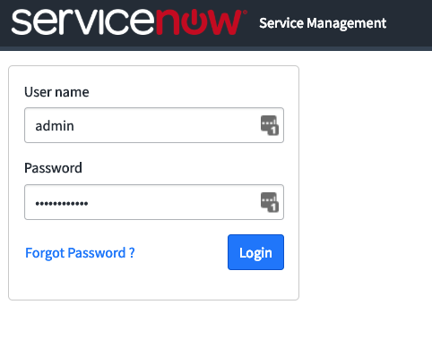
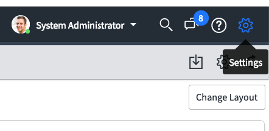
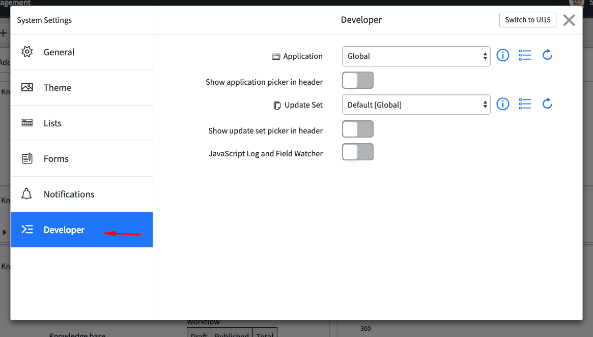
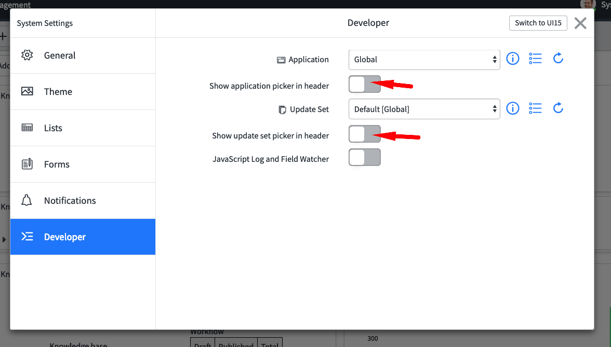

# Performance Analytics in Scoped Applications - Baseline and Custom Applications
## Creator Con Lab - CCW0764
### Presentation
**Estimated Time: 15 Mins**

# Part 1  
## Getting Logged in 
**Estimated Time: 10 Mins**

Access your course lab through cloud labs

*** INSTRUCTIONS HERE ***

# Part 2
## Reviewing Existing Indicators in Human Resources Scope
**Estimated Time: 15 Mins**

1. Log into the instance as an administrator

1. Click on the Gear Menu 

1. Navigate to the Developer Tab

1. Toggle the "Show Application Picket in Header"

1. Togggle the "Show Update Set in Header"

1. Close the Menu 

1. Switch Scopes in the dropdown to "Human Resources: Performance Analytics"

1. Navigate to System Update Set > Local Update Set

1. Click New

1. Set the Name as "CreatorCon < yourname > HR Core PA"

### Expanding Baseline Indicators

1. Navigate to System Definition > Plugins

1. Locate the "Performance Analytics - Content Pack - Human Resources Scoped App" plugin
** image here **

1. Open the Record

1. Click Activate **BE SURE to include Demo data**
** image here **

1. Once plugin activation is complete navigate to the Performance Analytics Application 

**TIP: type **"YT"** in the application navigator (quick access to the Performance Analytics Menu)**

### Data Collection

Now that new indicators have been added to the instance the data collections will need to be re-run to populate the indicators with scores.

1. Navigate to Performance Analytics > Data Collector > Jobs

1. Find the "[PA HR Case] Daily Data Collection" job

1. Open and click Execute Now 

1. Open the "[PA HR Case] Historic Data Collection" data collector

1. Adjust the collection paramaters to:
    - **Operator:** Relative
    - **Relative Start:** 3
    - **Relative start interval:** months ago

1. Click Execute Now

### Dashabord Review
1. Navigate to Performance Analytics > Dashboards 

1. Click on All

1. Find the HR Manager dashbaord and review the indicators 

1. Find the HR Agent dashbaord and review the indicators 

### Create a New Dashabord

1. Click New

1. Set the Name to **HR and Complaint Tracking**

1. Leave the other values as baseline

# Part 3
## Building new Indicators in HR Scope
**Estimated Time: 25 Mins**

1. Verify the update set created in Part 2 is selected in the drop down

1. Navigate to Performance Analytics > Indicators > Create New

1. Set the configuration as below:
    - **Indicator Name:**  HR Cases by COE
    - **Description:** Open HR cases by Center of Excellence 
    - **Direction:** Minimize 
    - **Unit:** #
    - **Group:** -None-

1. Click Next

1. Set Indicator Source: **HR.Case.Open**

1. Set Aggregate to **Count**

1. No additional conditions are needed at the bottom of the Data Source tab

1. Click next

1. Check these breakdowns:
    - Age
    - Asisgnment Group
    - Department 
    - HR Service
    - Location 
    - State
1. Click next 

1. Set the Job to **[PA HR Case] Daily Data Collection**

1. Verify **Collect data from the past** is checked 

1. Choose **90 Days ago** from the drop down

1. Click Next 

1. Check **Time Series Widget**

1. Set the Visualization to **Column**

1. Put the widget om the **HR and Complaint Tracking** dashboard created in step XX

1. Review the dashboard with the new indicator

** ADD Admin console here **

# Part 4
## Building new Indicators in a Custom Scope (Complaint Tracking)
**Estimated Time: 25 Mins**

1. Load the application from XML

1. Review Data and Configuration 

1. Switch Scopes in the dropdown to "Complaint Tracking"

1. Navigate to System Update Set > Local Update Set

1. Click New

1. Set the Name as "CreatorCon < yourname > Complaint Core PA"

1. In the **Application Navigator** type **yt** for the Performance Analytics Menu

1. Click on Indicators > Create New

   Set the configuration as below:
    - **Indicator Name:**  Complaint Cases per Day
    - **Description:** Open Complaint Cases per Day
    - **Direction:** Minimize 
    - **Unit:** #
    - **Group:** -None-

1. Click Next

1. Set Indicator Source: **Complaint.Case.Open**

1. Set Aggregate to **Count**

1. No additional conditions are needed at the bottom of the Data Source tab

1. Click next

1. Check these breakdowns:
    - Age
    - Asisgnment Group
    - Department 
    - Location 
    - State
1. Click next 

1. Set the Job to **[PA Complaint Case] Daily Data Collection**

1. Verify **Collect data from the past** is checked 

1. Choose **90 Days ago** from the drop down

1. Click Next 

1. Check **Time Series Widget**

1. Set the Visualization to **Column**

1. Put the widget om the **HR and Complaint Tracking** dashboard created in step XX

1. Review the dashboard with the new indicator

### Grouping By Location

1. Click on Performance Analytics > Widgets 

1. Click New

   Set the configuration as below:
    - **Name:**  Complaints by Location 
    - **Lookup Name:**  Complaints by Location 
    - **Description:** Open Complaint by Location
    - **Indicator:** Complaint Cases per Day 
    - **Breakdown:** Location

1. Click Save

1. Click on Performance Analytics > Dashabords

1. Location the **HR and Complaint Tracking** dashboard created in step XX

1. Click on the **+** on the dashboard to add a widget

1. Select **Performance Analytics** In the dropdown

1. Select Breakdown Type

1. Search by Name

1. Click Add

### Complaint Backlog 

 1. Navigate to Performance Analytics > Formula Indicators

1. Click New

   Set the configuration as below:
    - **Name:**  Complaints Backlog 
    - **Description:** Total Complaint flow
    - **Direction:** Minimize
    - **Unit:** #
    - **Formula:** `[Open Cases]-[Closed Cases]`
    

1. Click Submit

1. Navigate to Performance Analytics > Widgets

1. Click New

    Set the configuration as below:
    - **Name:**  Complaints Backlog Growth
    - **Lookup Name:**  Complaints Backlog Growth
    - **Description:** Complaints Backlog Growth
    - **Indicator:** Minimize
    - **Type:** Time Series
    - **Visualization:** Column Chart
    - **Period:** 3 Months 
    - **Show Date Range Selector:** Yes
1. Click Update 
 
1. Click on Performance Analytics > Dashabords

1. Location the **HR and Complaint Tracking** dashboard created in step XX

1. Click on the **+** on the dashabord to add a widget

1. Select **Performance Analytics** In the dropdown

1. Select Breakdown Type

1. Search by Name "Complaints Backlog Growth"

1. Click Add
